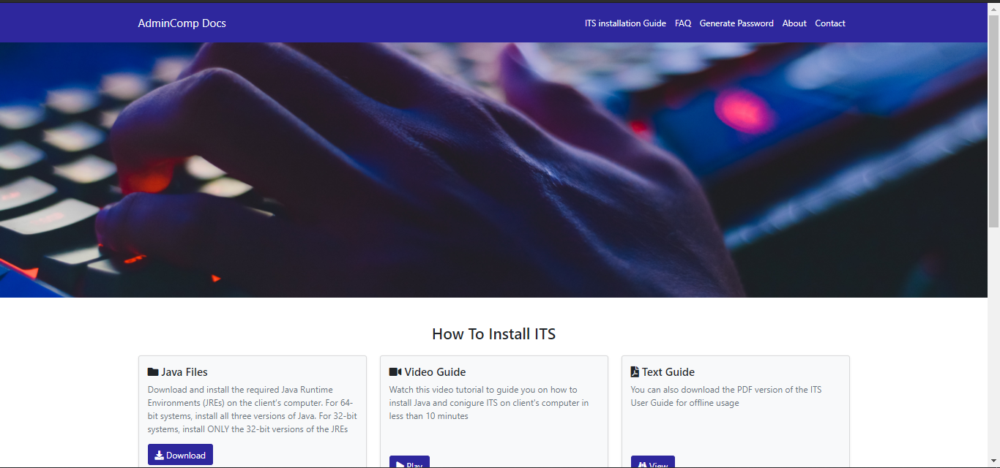

# AdminComp Docs

AdminComp Docs is a utility website designed solely for the Administrative Computing Unit (AdCU) of University of Ghana Computing Systems (UGCS)

## Motivation

The main aim of this project to assist AdCU staff, specifically ITS support Officers in the execution of their duties by providing up-to-date information on ITS installation, common ITS issues and Resolutions, Answers to Frequently Asked Questions (FAQs), and a Temporary Password Generator to help handle both MIS and ITS password issues quickly and swiftly, without errors or omissions.

## Screenshot

[]()

## URL

[AdminComp Docs Site](https://zen-ptolemy-6bcc40.netlify.app/)

## Installation

1. Clone Repo
2. cd to the directory where cloned folder is locacted
3. run: npm install in your shell

```bash
npm install
```

## Tech/framework used

1. HTML5
2. CSS3
3. Bootstrap 5
4. SASS
5. Netlify
6. JavaScript/jQuery
7. Firebase(Firestore)

## Contributing

Pull requests are welcome. For major changes, please open an issue first to discuss what you would like to change.
